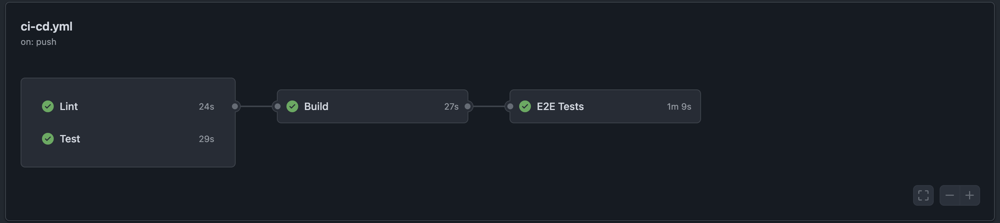

# Reactive API Console

A modern, interactive web application that provides a console-like interface for testing and exploring various APIs. Built with React, TypeScript, and Redux Toolkit, featuring real-time search, highlighting, and a responsive design.

🌐 **Live Demo**: [https://reactive-api-console.vercel.app](https://reactive-api-console.vercel.app)

## 🚀 Features

- **Interactive API Testing**: Execute commands to fetch data from various APIs
- **Real-time Search**: Global search across all API responses with highlighting
- **Responsive Design**: Modern UI built with Tailwind CSS
- **Type Safety**: Full TypeScript support throughout the application
- **State Management**: Redux Toolkit for predictable state management
- **Reactive Programming**: RxJS for handling asynchronous operations and data streams
- **Comprehensive Testing**: Unit tests, integration tests, and E2E tests with Cypress

## 🛠️ Tech Stack

- **Frontend**: React 19, TypeScript, Vite
- **Styling**: Tailwind CSS 4
- **State Management**: Redux Toolkit, React Redux
- **Reactive Programming**: RxJS
- **Testing**: Vitest, Testing Library, Cypress
- **Build Tool**: Vite
- **Package Manager**: pnpm

## 📋 Prerequisites

- Node.js 20 or higher
- pnpm (recommended) or npm

## 🚀 Quick Start

### 1. Clone the Repository

```bash
git clone https://github.com/marafa1985/reactive-api-console.git
cd reactive-api-console
```

### 2. Install Dependencies

```bash
# Using pnpm (recommended)
pnpm install

# Or using npm
npm install
```

### 3. Start Development Server

```bash
pnpm dev
```

The application will be available at `http://localhost:5173`

## 📖 Usage

### Available Commands

The console supports the following commands:

- `help` - Display available commands
- `clear` - clear all results
- `history` - Display messages history
- `get cat fact` - Fetch a random cat fact
- `get chuck norris joke` - Get a Chuck Norris joke
- `get bored activity` - Get a random activity suggestion
- `get github users` - Search GitHub users
- `get weather` - Get weather information

### Features

1. **Command Input**: Type commands in the chat console
2. **API Panels**: View responses in dedicated panels
3. **Global Search**: Search across all responses with highlighting
4. **Response Filtering**: Filter results based on search terms
5. **Response Pinning**: Pin important responses for quick access

## 🧪 Testing

### Unit Tests

Run unit tests with Vitest:

```bash
# Run all tests
pnpm test

# Run tests with UI
pnpm test:ui

# Run tests with coverage
pnpm test:coverage
```

### E2E Tests

Run end-to-end tests with Cypress:

```bash
# Open Cypress Test Runner
pnpm cy:open

# Run Cypress tests in headless mode
pnpm cy:run

# Run component tests
pnpm cy:open --component
```

### Linting

```bash
pnpm lint
```

## 🏗️ Build

### Development Build

```bash
pnpm build
```

### Preview Production Build

```bash
pnpm build
pnpm preview
```

## 📁 Project Structure

```
reactive-api-console/
├── .github/workflows/          # GitHub Actions CI/CD
│   └── ci-cd.yml              # Main CI/CD pipeline
├── cypress/                   # E2E and Component Testing
│   ├── component/             # Cypress component tests
│   │   └── ChatTitle.cy.tsx
│   ├── e2e/                   # End-to-end tests
│   │   ├── api-console.cy.ts
│   │   ├── drag-drop.cy.ts
│   │   ├── export.cy.ts
│   │   ├── highlighting.cy.ts
│   │   └── redux-integration.cy.ts
│   ├── fixtures/              # Test data
│   │   ├── cat-fact.json
│   │   └── example.json
│   ├── support/               # Cypress support files
│   │   ├── commands.ts
│   │   ├── component.ts
│   │   └── e2e.ts
│   └── cypress.config.js      # Cypress configuration
├── public/                    # Static assets
│   ├── robots.txt
│   └── vite.svg
├── src/                       # Source code
│   ├── assets/                # Static assets
│   │   └── react.svg
│   ├── components/            # React components (Atomic Design)
│   │   ├── atoms/             # Basic building blocks
│   │   │   ├── APINotFound/
│   │   │   ├── ChatSearchResult/
│   │   │   ├── ChatTitle/
│   │   │   ├── ChatWelcomeMessage/
│   │   │   ├── DragHint/
│   │   │   ├── DropIndicator/
│   │   │   ├── HighlightText/
│   │   │   ├── NoActiveAPI/
│   │   │   ├── NoActivePanel/
│   │   │   ├── NoResponses/
│   │   │   ├── NoResultMatched/
│   │   │   ├── PanelTitle/
│   │   │   ├── ResultWrapper/
│   │   │   └── SearchSummary/
│   │   ├── molecules/         # Composite components
│   │   │   ├── BoredAPI/
│   │   │   ├── CatFacts/
│   │   │   ├── ChatCommand/
│   │   │   ├── ChatLog/
│   │   │   ├── ChatSearch/
│   │   │   ├── ChuckNorris/
│   │   │   ├── ChuckNorrisJoke/
│   │   │   ├── DefaultAPIResponse/
│   │   │   ├── DraggableTab/
│   │   │   ├── FilterPanel/
│   │   │   ├── GithubUsers/
│   │   │   ├── PanelHeader/
│   │   │   ├── SideBarHeader/
│   │   │   ├── UserCommandInputProps/
│   │   │   └── Weather/
│   │   ├── organisms/         # Complex components
│   │   │   ├── ApiPanel/
│   │   │   ├── APIPanelContent/
│   │   │   ├── ApiPanelHeader/
│   │   │   ├── ApiPanelWrapper/
│   │   │   ├── AvailableAPIs/
│   │   │   ├── ChatMessages/
│   │   │   └── ChatPanel/
│   │   ├── pages/             # Page components
│   │   │   └── Home/
│   │   └── template/          # Layout templates
│   │       ├── ApiPanels.tsx
│   │       ├── Chat.tsx
│   │       ├── Header.tsx
│   │       ├── ResponsesPanel.tsx
│   │       └── SideBar.tsx
│   ├── core/                  # Business logic
│   │   ├── api/               # API integrations
│   │   │   ├── bored.api.ts
│   │   │   ├── cat-fact.api.ts
│   │   │   ├── chuck-norris.api.ts
│   │   │   ├── github-users.api.ts
│   │   │   ├── registry.ts
│   │   │   ├── utils.ts
│   │   │   └── weather.api.ts
│   │   ├── entity/            # Domain entities
│   │   │   ├── api-response.ts
│   │   │   ├── api.ts
│   │   │   ├── chat-messages.ts
│   │   │   └── user-command.ts
│   │   └── use-case/          # Business use cases
│   │       └── api-command.use-case.ts
│   ├── hooks/                 # Custom React hooks
│   │   ├── useApiCommands.ts
│   │   ├── useApiPanelsSortOrder.ts
│   │   ├── useApiSelectedPanel.ts
│   │   ├── useChat.ts
│   │   ├── useChatMessage.ts
│   │   ├── useCommandInput.ts
│   │   ├── useFilters.ts
│   │   └── useSpecialCommand.ts
│   ├── store/                 # Redux store
│   │   ├── feature/           # Redux slices
│   │   │   └── slices/
│   │   │       ├── apisSlice.ts
│   │   │       ├── chatSlice.ts
│   │   │       ├── filtersSlice.ts
│   │   │       ├── responsesSlice.ts
│   │   │       └── uiSlice.ts
│   │   ├── hooks.ts           # Redux hooks
│   │   ├── store.ts           # Store configuration
│   │   └── StoreProvider.tsx  # Store provider
│   ├── utils/                 # Utility functions
│   │   ├── cn.ts              # Class name utility
│   │   ├── formatTimestamp.ts
│   │   ├── highlight.ts       # Text highlighting
│   │   └── index.ts
│   ├── App.tsx                # Main App component
│   ├── main.tsx               # Application entry point
│   ├── index.css              # Global styles
│   └── test-setup.ts          # Test configuration
├── .eslintrc.js               # ESLint configuration
├── .gitignore                 # Git ignore rules
├── cypress.config.js          # Cypress configuration
├── index.html                 # HTML template
├── package.json               # Dependencies and scripts
├── pnpm-lock.yaml             # Lock file
├── pnpm-workspace.yaml        # Workspace configuration
├── tsconfig.json              # TypeScript configuration
├── tsconfig.app.json          # App-specific TS config
├── tsconfig.node.json         # Node-specific TS config
├── vite.config.ts             # Vite configuration
└── vitest.config.ts           # Vitest configuration
```

## 🔧 Configuration

### Environment Variables

No environment variables are required for basic functionality. The application uses public APIs.

### API Endpoints

The application integrates with the following public APIs:

- **Cat Facts**: `https://catfact.ninja/fact`
- **Chuck Norris Jokes**: `https://api.chucknorris.io/jokes/random`
- **Bored API**: `https://www.boredapi.com/api/activity`
- **GitHub Users**: `https://api.github.com/search/users`
- **Weather**: `https://api.open-meteo.com/v1/forecast`

## 🚀 Deployment

### Vercel (Recommended)

1. Connect your repository to Vercel
2. Vercel will automatically detect the Vite configuration
3. Deploy with default settings

### Manual Deployment

```bash
# Build the application
pnpm build

# The built files will be in the `dist/` directory
# Deploy the contents of `dist/` to your hosting provider
```

## 🤝 Contributing

1. Fork the repository
2. Create a feature branch (`git checkout -b feature/amazing-feature`)
3. Commit your changes (`git commit -m 'Add some amazing feature'`)
4. Push to the branch (`git push origin feature/amazing-feature`)
5. Open a Pull Request

### Development Guidelines

- Follow the existing code style and structure
- Write tests for new features
- Update documentation as needed
- Use conventional commit messages

## 📝 License

This project is licensed under the MIT License - see the LICENSE file for details.

## 🆘 Support

If you encounter any issues or have questions:

1. Check the existing issues in the repository
2. Create a new issue with detailed information
3. Include steps to reproduce the problem

## 🔄 CI/CD Pipeline

The project includes a comprehensive CI/CD pipeline with the following stages:

1. **Lint**: Code quality checks
2. **Test**: Unit and integration tests with coverage
3. **Build**: Production build verification
4. **E2E**: End-to-end testing with Cypress

The pipeline runs on every push and pull request to ensure code quality and functionality.


